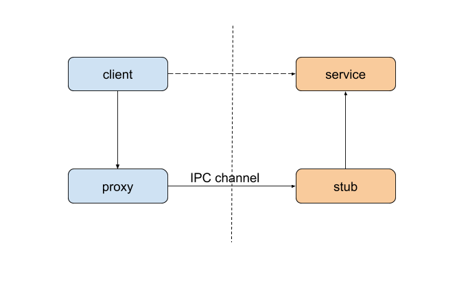

### binder 情景分析 - service 的注册（上篇）

#### RPC 原理简述

在开始之前，我们还是跟 [上篇](./startup-of-service-manager.md) 一样，先来了解一下基本的原理。



不同进程之间进行通信时，本质上还是只能够交换一下数据。方法、函数的调用是能够跨进程的。为了实现跨进程的函数调用，我们在原有 client 和 service 的基础上，增加两个对象——proxy 和 stub。客户端调用的，其实是 proxy 的函数。proxy 通过某些 IPC 通道，告知 stub。stub 读取 proxy 发生的数据，得知需要调用的函数后，再回调 service 对应的函数。

这样，从 client 和 service 的角度看，就好像是 client 调了 service 的函数。

<br>

#### 基本的服务注册流程

从应用的角度，服务的注册其实非常简单：

```C++
sp<IServiceManager> manager = defaultServiceManager();
manager->addService("serv_name", mBinder);
```
这样，就成功注册了一个叫 `serv_name` 的服务。下面，我们就详细了解一下，在两个简单的调用背后，到底发生了什么。

> 注：以下 framework 源码使用 oreo-release 分支，kernel 部分使用 common 的 android-4.9-o-release 分支。部分代码为了可读性，在不影响结果的情况下作了删改。

<br>

#### 获取 context manager 的 `IBinder`

我们先来看看 `defaultServiceManager()` 函数：
```C++
// frameworks/native/libs/binder/IServiceManager.cpp
sp<IServiceManager> defaultServiceManager() {
    if (gDefaultServiceManager != NULL) return gDefaultServiceManager;

    {
        AutoMutex _l(gDefaultServiceManagerLock);
        while (gDefaultServiceManager == NULL) {
            gDefaultServiceManager = interface_cast<IServiceManager>(
                ProcessState::self()->getContextObject(NULL));
            if (gDefaultServiceManager == NULL)
                sleep(1);
        }
    }

    return gDefaultServiceManager;
}
```

这里关键的一句，便是：
```C++
gDefaultServiceManager = interface_cast<IServiceManager>(
    ProcessState::self()->getContextObject(NULL));
```
`getContextObject(NULL)` 返回的，便是指向 `context manager` 的 `sp<IBinder>`：
```C++
// frameworks/native/libs/binder/ProcessState.cpp
sp<IBinder> ProcessState::getContextObject(const sp<IBinder>& /*caller*/) {
    return getStrongProxyForHandle(0);
}

// frameworks/native/libs/binder/ProcessState.cpp
sp<IBinder> ProcessState::getStrongProxyForHandle(int32_t handle) {
    sp<IBinder> result;

    AutoMutex _l(mLock);

    handle_entry* e = lookupHandleLocked(handle);

    if (e != NULL) {
        IBinder* b = e->binder;
        if (b == NULL || !e->refs->attemptIncWeak(this)) {
            b = new BpBinder(handle);
            e->binder = b;
            if (b) e->refs = b->getWeakRefs();
            result = b;
        } else {
            result.force_set(b);
            e->refs->decWeak(this);
        }
    }

    return result;
}
```

这里的 `handle` 类似于文件描述符，通过这个 handle，binder 驱动就可以找到对应的 `struct binder_node`，而 `binder_node` 则关联着对应的服务。而 `handle = 0` 特指 context manager。

`lookupHandleLocked()` 会先查找本地的缓存。如果已经为对应的 `handle` 生成过 `BpBinder`，则直接返回。即便没有，`lookupHandleLocked()` 也会创建一个 `handle_entry`，但是 `e->binder` 为空。接下来 `new BpBinder(handle)`，并把新生成的对象放到缓存中。

<br>

#### 各个类之间的关系

`BpBinder` 实际上是 `IBinder` 的类。在本篇中会涉及到的类之间的继承关系如下：


前面我们获取的 `BpBinder` 其实是 `IBinder` 的子类。以 `BpXXX` 方式命名的，都是运行在客户端的代理。

`IBinder` 和 `IInterface` 之间的转换关系下：


`IInterface` 在下面一节开始说明。

<br>

#### 获取 `IServiceManager` 代理对象

```C++
gDefaultServiceManager = interface_cast<IServiceManager>(
    ProcessState::self()->getContextObject(NULL));
```
再次回到一开始的这里，现在我们知道，`ProcessState::self()->getContextObject(NULL)` 会返回一个指向 `BpBinder` 的 `sp<IBinder>`。

下面是 `interface_cast`：
```C++
// frameworks/native/libs/binder/include/binder/IInterface.h
template<typename INTERFACE>
inline sp<INTERFACE> interface_cast(const sp<IBinder>& obj)
{
    return INTERFACE::asInterface(obj);
}
```
展开模板后是这样：
```C++
inline sp<IServiceManager> interface_cast(const sp<IBinder>& obj)
{
    return IServiceManager::asInterface(obj);
}
```

而 `IServiceManager::asInterface()` 是用宏生成的：
```C++
// frameworks/native/libs/binder/IServiceManager.cpp
IMPLEMENT_META_INTERFACE(ServiceManager, "android.os.IServiceManager");


// frameworks/native/libs/binder/include/binder/IInterface.h
#define IMPLEMENT_META_INTERFACE(INTERFACE, NAME)                       \
    const ::android::String16 I##INTERFACE::descriptor(NAME);           \
    const ::android::String16&                                          \
            I##INTERFACE::getInterfaceDescriptor() const {              \
        return I##INTERFACE::descriptor;                                \
    }                                                                   \
    ::android::sp<I##INTERFACE> I##INTERFACE::asInterface(              \
            const ::android::sp<::android::IBinder>& obj)               \
    {                                                                   \
        ::android::sp<I##INTERFACE> intr;                               \
        if (obj != NULL) {                                              \
            intr = static_cast<I##INTERFACE*>(                          \
                obj->queryLocalInterface(                               \
                        I##INTERFACE::descriptor).get());               \
            if (intr == NULL) {                                         \
                intr = new Bp##INTERFACE(obj);                          \
            }                                                           \
        }                                                               \
        return intr;                                                    \
    }                                                                   \
    I##INTERFACE::I##INTERFACE() { }                                    \
    I##INTERFACE::~I##INTERFACE() { }                                   \

```

展开后，`IServiceManager::asInterface()` 是这样的：

```C++
sp<IServiceManager> IServiceManager::asInterface(const sp<::android::IBinder>& obj)
{
    sp<IServiceManager> intr;
    if (obj != NULL) {
        intr = static_cast<IServiceManager*>(
            obj->queryLocalInterface(IServiceManager::descriptor).get());
        if (intr == NULL) {
            intr = new BpServiceManager(obj);
        }
    }
    return intr;
}
```

从上面的类关系，我们知道，`BpBinder` 继承了 `IBinder`。同时，它也继承了 `queryLocalInterface` 的实现：
```C++
// frameworks/native/libs/binder/Binder.cpp
sp<IInterface>  IBinder::queryLocalInterface(const String16& /*descriptor*/)
{
    return NULL;
}
```

上面的代码最终会执行 `intr = new BpServiceManager(obj);`，返回的是一个 `BpServiceManager` 对象。

到这里，我们就完成了服务注册的第一步——获取一个 `IServiceManager`，还知道了它实际上是一个 `BpServiceManager`。

```C++
// frameworks/native/libs/binder/IServiceManager.cpp
class BpServiceManager : public BpInterface<IServiceManager>
{
public:
    BpServiceManager(const sp<IBinder>& impl)
          : BpInterface<IServiceManager>(impl)
    {
    }

    // ...
}

// frameworks/native/libs/binder/include/binder/IInterface.cpp
template<typename INTERFACE>
inline BpInterface<INTERFACE>::BpInterface(const sp<IBinder>& remote)
    : BpRefBase(remote)
{
}


// frameworks/native/libs/binder/Binder.cpp
BpRefBase::BpRefBase(const sp<IBinder>& o)
    : mRemote(o.get()), mRefs(NULL), mState(0)
{
    extendObjectLifetime(OBJECT_LIFETIME_WEAK);

    if (mRemote) {
        mRemote->incStrong(this);           // Removed on first IncStrong().
        mRefs = mRemote->createWeak(this);  // Held for our entire lifetime.
    }
}


class BpRefBase : public virtual RefBase
{
protected:
    inline IBinder* remote() { return mRemote; }
    inline IBinder* remote() const { return mRemote; }
}
```
在 `BpServiceManager` 的构造函数里，它只是简单地将 `BpBinder` 传递给了父类 `BpInterface`。`BpInterface` 有继续传给父类，最终到了 `BpRefBase`，存在了成员变量 `mRemote` 里。

通过 `remote()` 函数，我们就可以重新拿到底层的 `BpBinder` 对象。

<br>

现在，我们终于完成了第一部分——获取一个 `IServiceManager` 对象。下一篇，我们再继续第二部分——服务的注册。

<br><br>


 
