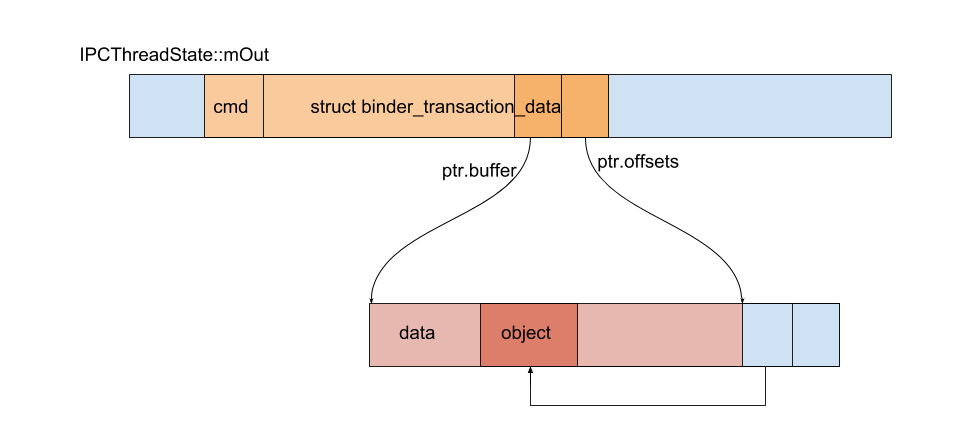
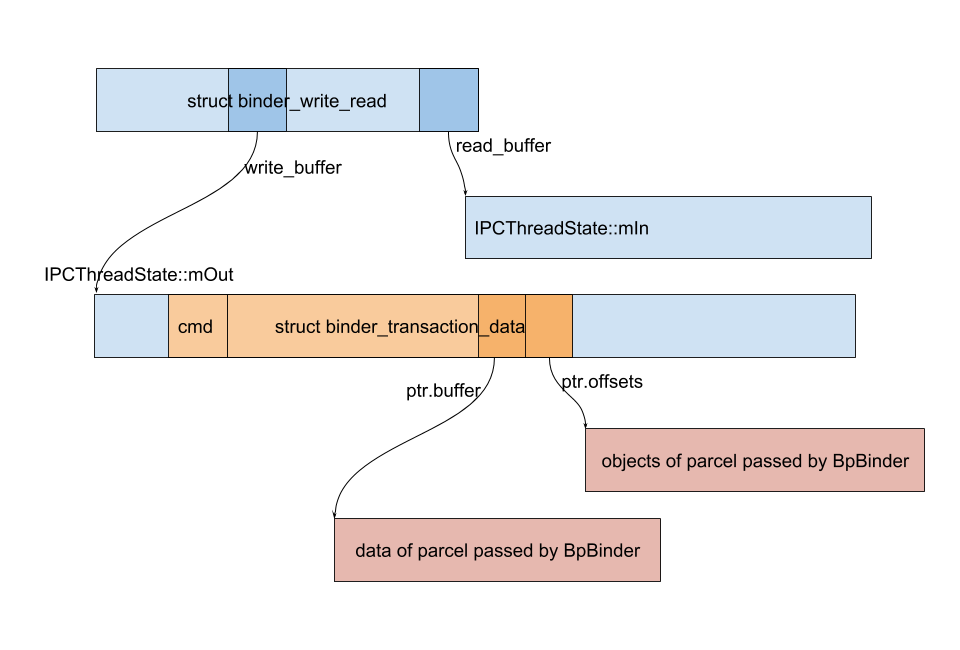

### binder 情景分析 - service 的注册（中篇）

#### 向 binder 写入数据

注册服务将调用 `BpServiceManager::addService()`：
```C++
// frameworks/native/libs/binder/IServiceManager.cpp
virtual status_t addService(const String16& name, const sp<IBinder>& service,
                            bool allowIsolated)
{
    Parcel data, reply;
    data.writeInterfaceToken(IServiceManager::getInterfaceDescriptor());
    data.writeString16(name);
    data.writeStrongBinder(service);
    data.writeInt32(allowIsolated ? 1 : 0);
    status_t err = remote()->transact(ADD_SERVICE_TRANSACTION, data, &reply);
    return err == NO_ERROR ? reply.readExceptionCode() : err;
}
```

这里通过 `parcel.writeStrongBinder()` 写入 `IBinder` 对象。由于是注册服务，这里的 `IBinder` 是一个 `BBinder`。

```C++
// frameworks/native/libs/binder/Parcel.cpp
status_t Parcel::writeStrongBinder(const sp<IBinder>& val)
{
    return flatten_binder(ProcessState::self(), val, this);
}

// frameworks/native/libs/binder/Parcel.cpp
status_t flatten_binder(const sp<ProcessState>& /*proc*/,
    const sp<IBinder>& binder, Parcel* out)
{
    flat_binder_object obj;

    IBinder* local = binder->localBinder();

    obj.type = BINDER_TYPE_BINDER;
    obj.binder = reinterpret_cast<uintptr_t>(local->getWeakRefs());
    obj.cookie = reinterpret_cast<uintptr_t>(local);

    return finish_flatten_binder(binder, obj, out);
}

// frameworks/native/libs/binder/Parcel.cpp
inline static status_t finish_flatten_binder(
    const sp<IBinder>& /*binder*/, const flat_binder_object& flat, Parcel* out)
{
    return out->writeObject(flat, false);
}

```
前面我们提到，这里传递进来的 `IBinder` 实际上是一个 `BBinder`，所以 `localBinder()` 所指向的是：
```C++
// frameworks/native/libs/binder/Binder.cpp
BBinder* BBinder::localBinder()
{
    return this;
}
```
于是，向 `flat_binder_object` 写入的，是 `BBinder` 的地址。也是通过这个地址，在 binder 驱动收到数据后，能够把数据回送给 `BBinder`。关于数据的接收，我们以后再讨论。

另一个需要特别注意的是，`type` 为 `BINDER_TYPE_BINDER`。

把数据都写入 `Parcel` 后，执行 `remote()->transact(ADD_SERVICE_TRANSACTION, data, &reply);`。

其中，`remote()` 返回的是前面我们拿到的指向 context manager 的 `BpBinder`，前面我们把它存在了 `BpRefBase::mRemote` 里。

随后，`BpBinder` 又通过 `IPCThreadState` 执行实际的写入数据操作：
```C++
// frameworks/native/libs/binder/BpBinder.cpp
status_t BpBinder::transact(
    uint32_t code, const Parcel& data, Parcel* reply, uint32_t flags)
{
    // Once a binder has died, it will never come back to life.
    if (mAlive) {
        status_t status = IPCThreadState::self()->transact(
            mHandle, code, data, reply, flags);
        if (status == DEAD_OBJECT) mAlive = 0;
        return status;
    }

    return DEAD_OBJECT;
}

// frameworks/native/libs/binder/IPCThreadState.cpp
status_t IPCThreadState::transact(int32_t handle,
                                  uint32_t code, const Parcel& data,
                                  Parcel* reply, uint32_t flags)
{
    err = writeTransactionData(BC_TRANSACTION, flags, handle, code, data, NULL);
    if (err != NO_ERROR) {
        if (reply) reply->setError(err);
        return (mLastError = err);
    }

    if ((flags & TF_ONE_WAY) == 0) {
        if (reply) {
            err = waitForResponse(reply);
        } else {
            Parcel fakeReply;
            err = waitForResponse(&fakeReply);
        }
    } else {
        err = waitForResponse(NULL, NULL);
    }
}
```
1. 调用 `writeTransactionData()` 写数据
2. 如果出错，直接返回
3. 调用不同的 `waitForResponse()` 写入并读取返回的数据


下面我们先看看 `writeTransactionData()`：
```C++
// frameworks/native/libs/binder/IPCThreadState.cpp
status_t IPCThreadState::writeTransactionData(int32_t cmd, uint32_t binderFlags,
    int32_t handle, uint32_t code, const Parcel& data, status_t* statusBuffer)
{
    binder_transaction_data tr;

    tr.target.ptr = 0;
    tr.target.handle = handle;
    tr.code = code;
    tr.flags = binderFlags;
    tr.cookie = 0;
    tr.sender_pid = 0;
    tr.sender_euid = 0;

    tr.data_size = data.ipcDataSize();
    tr.data.ptr.buffer = data.ipcData();
    tr.offsets_size = data.ipcObjectsCount() * sizeof(binder_size_t);
    tr.data.ptr.offsets = data.ipcObjects();

    mOut.writeInt32(cmd);
    mOut.write(&tr, sizeof(tr));

    return NO_ERROR;
}
```
几个值得注意的地方：
1. `cmd` 为 `BC_TRANSACTION`。
2. `tr.data.ptr.buffer` 指向实际的普通数据
3. `tr.data.ptr.offsets` 指向 objects。也就是前面我们通过 `writeObject(flat, false)` 写入的 `flat_binder_object`。
4. `mOut` 同样是一个 `Parcel`，我们将 `cmd` 和所构造的 `binder_transaction_data` 放在了这个 `mOut` 里面。比较容易令人迷惑的是，虽然函数名叫 `writeTransactionData`，实际上只是把数据写入了 `mOut` 里（还没有写入 binder 驱动）。

写入数据后如下图所示：



`waitForResponse()` 的第二个参数带有默认实参，所有上面的三个调用，`acquireResult` 都是 `NULL`。
```C++
// frameworks/native/libs/binder/include/binder/IPCThreadState.h
status_t waitForResponse(Parcel *reply,
                         status_t *acquireResult=NULL);

// frameworks/native/libs/binder/IPCThreadState.cpp
status_t IPCThreadState::waitForResponse(Parcel *reply, status_t *acquireResult)
{
    // ...
    err=talkWithDriver();
    // ...
}
```
`waitForResponse()` 向 binder 驱动写入数据，并读取返回值。关于返回值的处理，不是我们这里关心的东西，就直接略过了。感兴趣的读者可以自行查阅源码。函数中最关键的是 `talkWithDriver()`，正是它执行了读写工作。

```C++
// kernel/kernel_common/include/uapi/linux/android/binder.h
struct binder_write_read {
    binder_size_t     write_size;     // bytes to write
    binder_size_t     write_consumed; // bytes consumed by driver
    binder_uintptr_t  write_buffer;
    binder_size_t     read_size;      // bytes to read
    binder_size_t     read_consumed;  // bytes consumed by driver
    binder_uintptr_t  read_buffer;
};


// frameworks/native/libs/binder/IPCThreadState.cpp
status_t IPCThreadState::talkWithDriver(bool doReceive)
{
    binder_write_read bwr;

    // Is the read buffer empty?
    const bool needRead = mIn.dataPosition() >= mIn.dataSize();

    // We don't want to write anything if we are still reading
    // from data left in the input buffer and the caller
    // has requested to read the next data.
    const size_t outAvail = (!doReceive || needRead) ? mOut.dataSize() : 0;

    bwr.write_size = outAvail;
    bwr.write_buffer = (uintptr_t)mOut.data();

    // This is what we'll read.
    if (doReceive && needRead) {
        bwr.read_size = mIn.dataCapacity();
        bwr.read_buffer = (uintptr_t)mIn.data();
    } else {
        bwr.read_size = 0;
        bwr.read_buffer = 0;
    }

    // Return immediately if there is nothing to do.
    if ((bwr.write_size == 0) && (bwr.read_size == 0)) return NO_ERROR;

    bwr.write_consumed = 0;
    bwr.read_consumed = 0;
    status_t err;
    do {
        if (ioctl(mProcess->mDriverFD, BINDER_WRITE_READ, &bwr) >= 0)
            err = NO_ERROR;
        else
            err = -errno;

        if (mProcess->mDriverFD <= 0) {
            err = -EBADF;
        }
    } while (err == -EINTR);

    return err;
}
```
`struct binder_write_read` 作为一个媒介，在写入数据的同时，binder 驱动也通过它向应用返回数据。`bwr.write_buffer` 就指向 `Parcel mOut` 里的数据。`Parcel mIn` 用于读取数据。

数据的写入由 `ioctl` 完成，`command` 为 `BINDER_WRITE_READ`。

此时各个数据的关系如下图所示。



<br>

#### 传递数据给 context manager

我们知道，调用 `ioctl`，最后是由 binder 驱动的 `binder_ioctl()` 完成。

```C
// kernel/kernel_common/drivers/android/binder.c
static long binder_ioctl(struct file *filp, unsigned int cmd, unsigned long arg)
{
    // ...

    switch (cmd) {
    case BINDER_WRITE_READ:
        ret = binder_ioctl_write_read(filp, cmd, arg, thread);
        break;
    // ...
    }
    return ret;
}

// kernel/kernel_common/drivers/android/binder.c
static int binder_ioctl_write_read(struct file *filp,
                                   unsigned int cmd, unsigned long arg,
                                   struct binder_thread *thread)
{
    int ret = 0;
    struct binder_proc *proc = filp->private_data;
    unsigned int size = _IOC_SIZE(cmd);
    void __user *ubuf = (void __user *)arg;
    struct binder_write_read bwr;

    copy_from_user(&bwr, ubuf, sizeof(bwr));
    if (bwr.write_size > 0) {
        ret = binder_thread_write(proc, thread,
                                  bwr.write_buffer,
                                  bwr.write_size,
                                  &bwr.write_consumed);
    } else if (bwr.read_size > 0) {
        ret = binder_thread_read(proc, thread, bwr.read_buffer,
                                 bwr.read_size,
                                 &bwr.read_consumed,
                                 filp->f_flags & O_NONBLOCK)
        // ...
    }
    copy_to_user(ubuf, &bwr, sizeof(bwr));
    return ret;
}
```

前面我们调用 `ioctl` 传递进来的 `struct binder_write_read` 实际上是处于用户空间的。这里用 `copy_from_user()` 将用户空间的数据拷贝到内核。同样的，修改了 `bwr` 后，又通过 `copy_to_user()` 将结果拷贝回用户空间。

下面我们看看 `binder_thread_write`:
```C
// kernel/kernel_common/drivers/android/binder.c
static int binder_thread_write(struct binder_proc *proc,
                               struct binder_thread *thread,
                               binder_uintptr_t binder_buffer, size_t size,
                               binder_size_t *consumed)
{
    uint32_t cmd;
    struct binder_context *context = proc->context;
    void __user *buffer = (void __user *)(uintptr_t)binder_buffer;
    void __user *ptr = buffer + *consumed;
    void __user *end = buffer + size;

    while (ptr < end && thread->return_error.cmd == BR_OK) {
        int ret;

        if (get_user(cmd, (uint32_t __user *)ptr))
            return -EFAULT;
        ptr += sizeof(uint32_t);

        switch (cmd) {
        case BC_TRANSACTION:
        case BC_REPLY: {
            struct binder_transaction_data tr;

            if (copy_from_user(&tr, ptr, sizeof(tr)))
                return -EFAULT;
            ptr += sizeof(tr);
            binder_transaction(proc, thread, &tr,
                               cmd == BC_REPLY, 0);
            break;
        }
        // ...
        }
        *consumed = ptr - buffer;
    }
    return 0;
}
```

前面我们说，`IPCThreadState::transact()` 先是把数据写到 `mOut` 里，然后才把 `mOut` 的数据写到 binder 驱动。所以一次写入可能会有多个请求，这里使用 `while` 每个循环处理一个。

现在，我们最好再看一次上面画的图：


在 `binder_ioctl_write_read()` 我们第一次调用 `copy_from_user()`，拷贝的是 `binder_write_read`。`bwr.write_buffer` 指向的是 `IPCThreadState::mOut` 中的数据，所以这里再一次调用 `copy_from_user()`，可以读到一个 transaction 的 `cmd`（`cmd`放在头部）。

接下来，我们再次调用 `copy_from_user()` 把 `binder_transaction_data` 也拷贝到内核。然后把 `binder_transaction_data` 交给 `binder_transaction()` 处理。

```C
// kernel/kernel_common/drivers/android/binder.c
static void binder_transaction(struct binder_proc *proc,
                               struct binder_thread *thread,
                               struct binder_transaction_data *tr, int reply,
                               binder_size_t extra_buffers_size)
{
    struct binder_transaction *t;
    struct binder_work *tcomplete;
    struct binder_proc *target_proc = NULL;
    struct binder_thread *target_thread = NULL;
    struct binder_node *target_node = NULL;

    if (tr->target.handle) {
        // ...
    } else {
        target_node = context->binder_context_mgr_node;
    }
    target_proc = target_node->proc;

    t = kzalloc(sizeof(*t), GFP_KERNEL);
    tcomplete = kzalloc(sizeof(*tcomplete), GFP_KERNEL);

    if (!reply && !(tr->flags & TF_ONE_WAY))
        t->from = thread;
    else
        t->from = NULL;
    t->sender_euid = task_euid(proc->tsk);
    t->to_proc = target_proc;
    t->to_thread = target_thread;
    t->code = tr->code;
    t->flags = tr->flags;
    t->buffer = binder_alloc_new_buf(&target_proc->alloc, tr->data_size,
          tr->offsets_size, extra_buffers_size,
          !reply && (t->flags & TF_ONE_WAY));
    t->buffer->allow_user_free = 0;
    t->buffer->debug_id = t->debug_id;
    t->buffer->transaction = t;
    t->buffer->target_node = target_node;

    off_start = (binder_size_t *)(t->buffer->data +
          ALIGN(tr->data_size, sizeof(void *)));
    offp = off_start;

    copy_from_user(t->buffer->data, (const void __user *)(uintptr_t)
                   tr->data.ptr.buffer, tr->data_size);
    copy_from_user(offp, (const void __user *)(uintptr_t)
                   tr->data.ptr.offsets, tr->offsets_size);

    // ...
}
```
这里先看 `binder_transaction()` 是前半部分。

1. 分配了两个对象 `binder_transaction` 和 `binder_work`。`binder_work` 后面我们就会看到它的作用，这里先忽略。
2. 调用 `binder_alloc_new_buf` 分配了一块缓存。这里分配的缓存是 context manager 的调用 `mmap` 时候所创建的。
3. 拷贝 `Parcel` 的数据
4. 拷贝 `Parcel` 的对象

我们知道，内核的页和用户空间的页同时执行 `mmap` 所分配的缓存。所以这里虽然是拷贝到了内核，context manager 也能够直接读取这里拷贝的到 `Parcel` 的数据。也就是说，从一个进程到另一个进程，数据只拷贝了一次。这就是 binder 高效的原因。

读取到数据后，开始循环处理 `Parcel` 里所有的对象：
```C
// kernel/kernel_common/drivers/android/binder.c
static void binder_transaction(struct binder_proc *proc,
                               struct binder_thread *thread,
                               struct binder_transaction_data *tr, int reply,
                               binder_size_t extra_buffers_size)
{
    // ...

    off_end = (void *)off_start + tr->offsets_size;
    for (; offp < off_end; offp++) {
        struct binder_object_header *hdr;

        hdr = (struct binder_object_header *)(t->buffer->data + *offp);
        switch (hdr->type) {
        case BINDER_TYPE_BINDER: {
            struct flat_binder_object *fp;

            fp = to_flat_binder_object(hdr);
            ret = binder_translate_binder(fp, t, thread);
        }
        // ...
        }
    }

    // ...
}
```

不知道你还记不记得，前面把 `BBinder` 写入 `Parcel` 时，我们设置 `type` 为 `BINDER_TYPE_BINDER`。

下面继续处理 `flat_binder_object`：

```C
// kernel/kernel_common/drivers/android/binder.c
static int binder_translate_binder(struct flat_binder_object *fp,
                                   struct binder_transaction *t,
                                   struct binder_thread *thread)
{
    node = binder_get_node(proc, fp->binder);
    if (!node) {
        node = binder_new_node(proc, fp);
    }
    ret = binder_inc_ref_for_node(target_proc, node,
                fp->hdr.type == BINDER_TYPE_BINDER,
                &thread->todo, &rdata);

    if (fp->hdr.type == BINDER_TYPE_BINDER)
        // XXX NOTICE!!
        fp->hdr.type = BINDER_TYPE_HANDLE;
    else
        fp->hdr.type = BINDER_TYPE_WEAK_HANDLE;
    fp->binder = 0;
    fp->handle = rdata.desc;
    fp->cookie = 0;

    binder_put_node(node);
    return ret;
}
```
**这里发生了一件非常关键的事：我们把 `flat_binder_object` 的类型修改为 `BINDER_TYPE_HANDLE` 了！** 所以，当 context manager 从 `Parcel` 里面读取 `IBinder` 的时候，拿到的将会是 `BpBinder`（而不是原来的 `BBinder`）。这一点很重要，因为 context manager 跟我们的服务运行在不同的进程中，所以 context manager 理应持有 `BpBinder`。

服务向 context manager 注册的时候，是第一次传递 `IBinder`，所以这里的 `binder_get_node()` 会返回 `NULL`。接着便会为服务创建一个 `binder_node`。

`binder_proc.nodes` 是一个 `struct rb_node`。它是 Linux 内核实现的红黑树数据结构。`binder_get_node` 尝试获取一个 `binder_node`，如果找不到，就会新建一个，然后插入 `binder_proc.nodes` 这棵红黑树中。这里插入的是调用进程的 `binder_proc`。

`binder_inc_ref_for_node()` 则生成一个 `struct binder_ref`。他同时会插入 `binder_proc.refs_by_desc` 和 `binder_proc.refs_by_node`。`binder_ref` 可以看成 `binder_node` 的指针。只要持有 `binder_ref`，就可以拿到对应的 `binder_node`。（注意，函数的第一个参数是 `target_proc`，`binder_ref` 插入的是 context manager 的 `binder_proc`。

当其他进程向 context manager 查询服务时，binder 驱动就会为它生成一个 `binder_ref`，它指向对应服务的 `binder_node`。当然，真正的 `binder_node` 保存在了所属的 `binder_proc` 里。一个服务永远只对应一个 `binder_node`，`binder_ref` 却可以有多个。

我们下面看 `binder_transaction` 的最后一部分：
```C
// kernel/kernel_common/drivers/android/binder.c
static void binder_transaction(struct binder_proc *proc,
                               struct binder_thread *thread,
                               struct binder_transaction_data *tr, int reply,
                               binder_size_t extra_buffers_size)
{
    // ...

    tcomplete->type = BINDER_WORK_TRANSACTION_COMPLETE;
    binder_enqueue_work(proc, tcomplete, &thread->todo);
    t->work.type = BINDER_WORK_TRANSACTION;

    if (reply) {
        binder_enqueue_work_ilocked(&t->work, &target_thread->todo);
        wake_up_interruptible_sync(&target_thread->wait);
      }
}
```
我们将上面创建的 `struct binder_work *tcomplete` 放入调用线程（也就是要注册服务的那个线程）的工作队列 `thread->todo` 中。`struct binder_work *t` 则放入 context manager 的任务队列，然后唤醒 context manager。context manager 醒来后，就会取出工作队列中的 `binder_work` 进行处理（注意，这里会运行在 context manager 的 binder 线程中。

在 `binder_ioctl_write_read()` 中，共有两部分，write 我们已经讲完了；read 部分等到服务在 context manager 注册完成后，再进行讲解。这里的 `tcomplete` 任务也会在 read 部分得到执行。

最后总结一下数据写入操作的函数调用流程：


 
