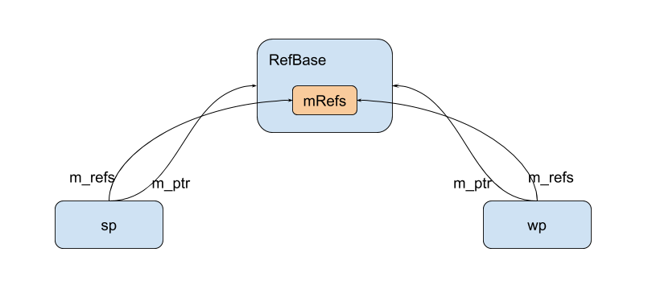

### binder 情景分析 - 为什么注册后的 BBinder 不会被意外释放？（上）—— 理解 RefBase、sp、wp

#### 问题概述

问题的起因是这样的。在注册服务的时候，我们保存了 `BBinder` 的地址和对应 `mRefs`(类型为 `class RefBase::weakref_impl`)：

```C++
obj.type = BINDER_TYPE_BINDER;
obj.binder = reinterpret_cast<uintptr_t>(local->getWeakRefs());
obj.cookie = reinterpret_cast<uintptr_t>(local);


RefBase::weakref_type* RefBase::getWeakRefs() const
{
    return mRefs;
}
```

然后，当 `IPCThreadState` 收到数据后，再尝试获取一个强指针：
```C++
if (tr.target.ptr) {
    // We only have a weak reference on the target object, so we must first try to
    // safely acquire a strong reference before doing anything else with it.
    if (reinterpret_cast<RefBase::weakref_type*>(
            tr.target.ptr)->attemptIncStrong(this)) {
        error = reinterpret_cast<BBinder*>(tr.cookie)->transact(tr.code, buffer,
                &reply, tr.flags);
        reinterpret_cast<BBinder*>(tr.cookie)->decStrong(this);
    } else {
        error = UNKNOWN_TRANSACTION;
    }
}
```

问题在于，当 `BBinder` 的强、弱应用计数都为 0 的时候，无论是 `BBinder` 还是 `mRefs`，都会被释放，这样一来，`IPCThreadState` 就会 segment fault 了。所以，binder 驱动肯定背着我们偷偷做了什么处理。那么，他又是如何处理的呢？


本篇先讲解 `RefBase/sp/wp`，了解过的朋友可以阅读 [下篇](./binder-why-BBinder-not-released-after-registered-part2.md)。

> 注：源码使用 oreo-release 分支。为了可读性，在不影响结果的情况下，部分代码有删改。

#### RefBase, sp, wp 用法概述

`RefBase, sp, wp` 使用引用计数，打造了一个强、弱引用框架，在 Android framework 中曝光率非常高，使用也很简单：
```C++
class Foo : public RefBase {
public:
    void foo() {}
};

void bar() {
    sp<Foo> spFoo{new Foo};
    spFoo->foo();

    wp<Foo> wpFoo{spFoo};
}
```
`sp, wp` 有很多构造函数，这里只是稍微举了两个例子

#### 实现——`sp, wp` 的构造

我们先来看 `RefBase`：
```C++
// system/core/libutils/include/utils/RefBase.h
class RefBase
{
// ...

private:
    weakref_impl* const mRefs;
};

// system/core/libutils/RefBase.cpp
class RefBase::weakref_impl : public RefBase::weakref_type
{
public:
    std::atomic<int32_t>    mStrong;
    std::atomic<int32_t>    mWeak;
    RefBase* const          mBase;
    std::atomic<int32_t>    mFlags;

    // ...
}
```
这里最关键的地方在于，`RefBase` 有一个成员变量叫 `mRefs`，`mRefs` 存储了强、弱引用的计数。`std::atomic` 是 C++11 提供的原子变量。

下面我们看看初始化部分：
```C++
// system/core/libutils/RefBase.cpp
RefBase::RefBase()
    : mRefs(new weakref_impl(this))
{
}

// system/core/libutils/RefBase.cpp
#define INITIAL_STRONG_VALUE (1<<28)

// system/core/libutils/RefBase.cpp
class RefBase::weakref_impl : public RefBase::weakref_type
{
public:
    explicit weakref_impl(RefBase* base)
        : mStrong(INITIAL_STRONG_VALUE)
        , mWeak(0)
        , mBase(base)
        , mFlags(0)
    {
    }
}

// system/core/libutils/include/utils/RefBase.h
enum {
    OBJECT_LIFETIME_STRONG  = 0x0000,
    OBJECT_LIFETIME_WEAK    = 0x0001,
    OBJECT_LIFETIME_MASK    = 0x0001
};
```
在构造函数中，我们把强引用计数初始化为 `INITIAL_STRONG_VALUE`，目的是标记“目前还没有`sp`指向对象”这一个状态，后面我们还会再遇到他。

`mFlags` 有 2 个可能的取值，默认我 `OBJECT_LIFETIME_STRONG`。

下面我们看看构造一个 `sp` 的情形：
```C++
// system/core/libutils/include/utils/StrongPointer.h
template<typename T>
class sp {
private:
    T* m_ptr;
};

// system/core/libutils/include/utils/StrongPointer.h
template<typename T>
sp<T>::sp(T* other)
        : m_ptr(other) {
    if (other)
        other->incStrong(this);
}
```
`m_ptr` 是指向实际对象的指针，这个对象就是我们上面 `new` 出来的 `Foo`。同时，我们知道 `Foo` 继承了 `RefBase`，`incStrong()` 其实是 `RefBase` 的成员函数，用来增加强引用计数：
```C++
// system/core/libutils/RefBase.cpp
void RefBase::incStrong(const void* id) const
{
    weakref_impl* const refs = mRefs;
    refs->incWeak(id);

    refs->addStrongRef(id); // nop
    const int32_t c = refs->mStrong.fetch_add(1, std::memory_order_relaxed);

    if (c != INITIAL_STRONG_VALUE)  {
        return;
    }

    int32_t old = refs->mStrong.fetch_sub(INITIAL_STRONG_VALUE,
            std::memory_order_relaxed);
    refs->mBase->onFirstRef();
}
```
这里我们先调用 `incWeak` 增加了弱引用计数，然后再调用 `fetch_add` 增加强引用计数并返回旧值。`addStrongRef()` 在 release 版本是空实现，这里不管他。

如果强引用的旧值是 `INITIAL_STRONG_VALUE`，说明这是第一个 `sp` 指向它。此时需要减去 `INITIAL_STRONG_VALUE`。减去后，`mStrong == 1`。通过使用 `INITIAL_STRONG_VALUE`，我们可以知道某个对象是否曾经被 `sp` 持有过。

随后，回调 `onFirstRef()`。子类可以重写 `onFirstRef`，在第一次被使用的时候做一些工作。

`incWeak` 的实现也是相当直接的。不过，这里是父类 `weakref_type`。我也不明白为什么要在这里实现。（反正，先不管设计，我们现在关心的是实现）
```C++
// system/core/libutils/RefBase.cpp
void RefBase::weakref_type::incWeak(const void* id)
{
    weakref_impl* const impl = static_cast<weakref_impl*>(this);
    impl->addWeakRef(id); // nop
    const int32_t c __unused = impl->mWeak.fetch_add(1,
            std::memory_order_relaxd);
```
所以，创建一个 `sp` 会使得强、弱引用的计数都加1。

下面看 `wp` 的构造：
```C++
// system/core/libutils/include/utils/RefBase.h
template<typename T>
wp<T>::wp(const sp<T>& other)
    : m_ptr(other.m_ptr)
{
    if (m_ptr) {
        m_refs = m_ptr->createWeak(this);
    }
}

// system/core/libutils/RefBase.cpp
RefBase::weakref_type* RefBase::createWeak(const void* id) const
{
    mRefs->incWeak(id);
    return mRefs;
}
```
创建一个 `wp`，会使得弱引用计数加1。此时，对象之间的关系如下：



#### 实现——`sp, wp` 的析构

我们先看看 `sp` 的析构：
```C++
// system/core/libutils/include/utils/StrongPointer.h
template<typename T>
sp<T>::~sp() {
    if (m_ptr)
        m_ptr->decStrong(this);
}

// system/core/libutils/RefBase.cpp
void RefBase::decStrong(const void* id) const
{
    weakref_impl* const refs = mRefs;
    refs->removeStrongRef(id); // nop
    const int32_t c = refs->mStrong.fetch_sub(1, std::memory_order_release);

    if (c == 1) {
        std::atomic_thread_fence(std::memory_order_acquire);
        refs->mBase->onLastStrongRef(id);
        int32_t flags = refs->mFlags.load(std::memory_order_relaxed);
        if ((flags&OBJECT_LIFETIME_MASK) == OBJECT_LIFETIME_STRONG) {
            delete this;
            // The destructor does not delete refs in this case.
        }
    }
    // Note that even with only strong reference operations, the thread
    // deallocating this may not be the same as the thread deallocating refs.
    // That's OK: all accesses to this happen before its deletion here,
    // and all accesses to refs happen before its deletion in the final decWeak.
    // The destructor can safely access mRefs because either it's deleting
    // mRefs itself, or it's running entirely before the final mWeak decrement.
    refs->decWeak(id);
}
```
和其他智能指针的实现一样，这里把强引用计数减1。如果 `c == 1`，减 1 后强引用计数就是 0。也就是说，我们是最后一个指向这个对象的 `sp`。此时就得根据 `mFlags` 来决定如何处理了。

1. 如果是 `OBJECT_LIFETIME_STRONG`（默认情况），当强引用计数为 0 时，需要删除对象。所以，执行了 `delete this`。
2. 如果是其他，也就是 `OBJECT_LIFETIME_WEAK`，则暂时先不删除对象。（如果是低版本的Android，还有一个 `OBJECT_LIFETIME_FOREVER`，估计是过于危险，Google把它去掉了）

下面，我们继续 `decWeak`：
```C++
// system/core/libutils/RefBase.cpp
void RefBase::weakref_type::decWeak(const void* id)
{
    weakref_impl* const impl = static_cast<weakref_impl*>(this);
    impl->removeWeakRef(id);
    const int32_t c = impl->mWeak.fetch_sub(1, std::memory_order_release);
    if (c != 1) return;
    atomic_thread_fence(std::memory_order_acquire);

    int32_t flags = impl->mFlags.load(std::memory_order_relaxed);
    if ((flags&OBJECT_LIFETIME_MASK) == OBJECT_LIFETIME_STRONG) {
        // This is the regular lifetime case. The object is destroyed
        // when the last strong reference goes away. Since weakref_impl
        // outlives the object, it is not destroyed in the dtor, and
        // we'll have to do it here.
        if (impl->mStrong.load(std::memory_order_relaxed)
                == INITIAL_STRONG_VALUE) {
            // Decrementing a weak count to zero when object never had a strong
            // reference.  We assume it acquired a weak reference early, e.g.
            // in the constructor, and will eventually be properly destroyed,
            // usually via incrementing and decrementing the strong count.
            // Thus we no longer do anything here.  We log this case, since it
            // seems to be extremely rare, and should not normally occur. We
            // used to deallocate mBase here, so this may now indicate a leak.
            ALOGW("RefBase: Object at %p lost last weak reference "
                    "before it had a strong reference", impl->mBase);
        } else {
            // ALOGV("Freeing refs %p of old RefBase %p\n", this, impl->mBase);
            delete impl;
        }
    } else {
        // This is the OBJECT_LIFETIME_WEAK case. The last weak-reference
        // is gone, we can destroy the object.
        impl->mBase->onLastWeakRef(id);
        delete impl->mBase;
    }
}
```
一样的，这里把弱引用计数减1。如果弱引用计数减 1 后为 0，可能就需要释放一些对象了。

1. 如果是 `OBJECT_LIFETIME_STRONG` 并且 `mStrong == INITIAL_STRONG_VALUE`，表明没有创建过 `sp`（却创建了 `wp`）。这时候很可能是程序员手抖，于是，打个 log。
2. `OBJECT_LIFETIME_STRONG` 并且创建过 `sp`，说明此时已经没有 `sp, wp` 指向这个对象了。由于对象在强引用计数减 1 的时候已经删除，现在把 `mRefs` 删掉就可以了（这里的 `impl` 就是 `mRefs`）
3. `mFlags` 是 `OBJECT_LIFETIME_WEAK`。表明即便强引用计数为0，也暂时不删除对象。由于现在弱引用计数也为 0 了，必须删除对象（`delete impl->mBase`）。

删除 `RefBase` 后，会执行 `RefBase` 的析构函数：
```C++
// system/core/libutils/RefBase.cpp
RefBase::~RefBase()
{
    int32_t flags = mRefs->mFlags.load(std::memory_order_relaxed);
    // Life-time of this object is extended to WEAK, in
    // which case weakref_impl doesn't out-live the object and we
    // can free it now.
    if ((flags & OBJECT_LIFETIME_MASK) == OBJECT_LIFETIME_WEAK) {
        // It's possible that the weak count is not 0 if the object
        // re-acquired a weak reference in its destructor
        if (mRefs->mWeak.load(std::memory_order_relaxed) == 0) {
            delete mRefs;
        }
    } else if (mRefs->mStrong.load(std::memory_order_relaxed)
            == INITIAL_STRONG_VALUE) {
        // We never acquired a strong reference on this object.
        LOG_ALWAYS_FATAL_IF(mRefs->mWeak.load() != 0,
                "RefBase: Explicit destruction with non-zero weak "
                "reference count");
        // TODO: Always report if we get here. Currently MediaMetadataRetriever
        // C++ objects are inconsistently managed and sometimes get here.
        // There may be other cases, but we believe they should all be fixed.
        delete mRefs;
}
```
1. 如果是 `OBJECT_LIFETIME_WEAK` 并且弱引用计数为 0，删除 `mRefs`。
2. 如果是 `OBJECT_LIFETIME_STRONG`，`mRefs` 会在 `decWeak` 的时候被删除，所以这里什么都不用做。
3. 如果没有被 `sp` 持有过，跟上面讨论的一样，很可能是 `bug`, 打个 log，然后再删除 `mRefs`。

总结一下（异常的情况不考虑）：
1. 如果是 `OBJECT_LIFETIME_STRONG`，`decStrong()` 会删除对象，由于此时弱引用计数不为0，`~RefBase()` 什么都不做。`decWeak()` 删除 `mRefs`
2. 如果是 `OBJECT_LIFETIME_WEAK`，`decWeak()` 删除对象，`~RefBase()` 删除 `mRefs`。


#### 从 `wp` 提升至 `sp`

和 Java 的时候一样，如果持有的是 `wp`，使用的时候需要从 `wp` 提升至 `sp`：
```C++
sp<Foo> spFoo = wpFoo->promote();
if (spFoo) {
    // use spFoo
}
```

下面我们就来看看他是如何实现的：
```C++
// system/core/libutils/include/utils/RefBase.h
template<typename T>
sp<T> wp<T>::promote() const
{
    sp<T> result;
    if (m_ptr && m_refs->attemptIncStrong(&result)) {
        result.set_pointer(m_ptr);
    }
    return result;
}
```
首先尝试增加一个强引用计数，如果成功了，说明 `m_ptr` 还有效，返回结果。如果失败，说明 `m_ptr` 已经被释放，返回的 `result` 是空的。

```C++
// system/core/libutils/RefBase.cpp
bool RefBase::weakref_type::attemptIncStrong(const void* id)
{
    // 首先，我们增加弱引用计数，无论如何，这个调用都会成功
    incWeak(id);

    weakref_impl* const impl = static_cast<weakref_impl*>(this);
    int32_t curCount = impl->mStrong.load(std::memory_order_relaxed);

    // 现在，我们尝试增加强引用计数
    // 如果 curCount > 0 && curCount != INITIAL_STRONG_VALUE,
    // 说明当前有 sp 指向这个对象。
    // 最好的（也是一般的）情况下，我们会在 sp 删除对象前，使得强引用计数+1，
    // 这样一来，我们的工作就结束了
    // 注意：即使刚进来的时候 curCount > 0，在我们+1之前，也有可能变为 0
    while (curCount > 0 && curCount != INITIAL_STRONG_VALUE) {
        // we're in the easy/common case of promoting a weak-reference
        // from an existing strong reference.
        // 如果成功，返回 true
        // 如果失败，返回 false，同时修改 curCount 为当前值
        if (impl->mStrong.compare_exchange_weak(curCount, curCount+1,
                std::memory_order_relaxed)) {
            break;
        }
        // the strong count has changed on us, we need to re-assert our
        // situation. curCount was updated by compare_exchange_weak.
    }

    // 如果上面的 while 成功，这里的 if 不会执行

    // 1. 对象已经被释放，上面的 while 循环根本没有执行或执行过程中对象被释放，curCount <= 0 （其实只会等于 0）
    // 2. 目前没有强引用指向它
    if (curCount <= 0 || curCount == INITIAL_STRONG_VALUE) {
        // we're now in the harder case of either:
        // - there never was a strong reference on us
        // - or, all strong references have been released
        int32_t flags = impl->mFlags.load(std::memory_order_relaxed);
        if ((flags&OBJECT_LIFETIME_MASK) == OBJECT_LIFETIME_STRONG) {
            // this object has a "normal" life-time, i.e.: it gets destroyed
            // when the last strong reference goes away
            // OBJECT_LIFETIME_STRONG 并且 curCount <= 0
            // 说明对象被某个 sp 释放了
            if (curCount <= 0) {
                // the last strong-reference got released, the object cannot
                // be revived.
                // 一开始我们 incWeak，所以这里要减回去
                decWeak(id);
                return false;
            }

            // 这里还没有 sp 指向对象，可以开始尝试增加强引用计数
            // here, curCount == INITIAL_STRONG_VALUE, which means
            // there never was a strong-reference, so we can try to
            // promote this object; we need to do that atomically.
            while (curCount > 0) {
                if (impl->mStrong.compare_exchange_weak(curCount, curCount+1,
                        std::memory_order_relaxed)) {
                    break;
                }
                // the strong count has changed on us, we need to re-assert our
                // situation (e.g.: another thread has inc/decStrong'ed us)
                // curCount has been updated.
            }

            // 在我们尝试增加强引用计数的时候，可能会有某个 sp 生成，而后销毁，导致我们增加强引用计数失败
            if (curCount <= 0) {
                // promote() failed, some other thread destroyed us in the
                // meantime (i.e.: strong count reached zero).
                decWeak(id);
                return false;
            }
        } else {
            // 这里是 OBJECT_LIFETIME_WEAK
            // 这种情况下，即使强引用计数为0，对象仍然不会被销毁
            // 如果使用 RefBase 的默认实现onIncStrongAttempted() 将返回 true
            // 这是一个 virtual 函数，子类可以重写它
            // this object has an "extended" life-time, i.e.: it can be
            // revived from a weak-reference only.
            // Ask the object's implementation if it agrees to be revived
            if (!impl->mBase->onIncStrongAttempted(FIRST_INC_STRONG, id)) {
                // it didn't so give-up.
                decWeak(id);
                return false;
            }
            // 现在，我们可以安全地使强引用计数加 1 了。
            // grab a strong-reference, which is always safe due to the
            // extended life-time.
            curCount = impl->mStrong.fetch_add(1, std::memory_order_relaxed);
            // If the strong reference count has already been incremented by
            // someone else, the implementor of onIncStrongAttempted() is holding
            // an unneeded reference.  So call onLastStrongRef() here to remove it.
            // (No, this is not pretty.)  Note that we MUST NOT do this if we
            // are in fact acquiring the first reference.
            if (curCount != 0 && curCount != INITIAL_STRONG_VALUE) {
                impl->mBase->onLastStrongRef(id);
            }
        }
    }

    impl->addStrongRef(id); // nop

    // 如果 curCount 是 INITIAL_STRONG_VALUE，而前面我们已经给他加1
    // 所以 mStrong 现在是 (INITIAL_STRONG_VALUE+1)
    // 减去 INITIAL_STRONG_VALUE 后，就变为 1
    // 刚好是我们返回的那个 sp 对应的强引用计数
    // curCount is the value of mStrong before we incremented it.
    // Now we need to fix-up the count if it was INITIAL_STRONG_VALUE.
    // This must be done safely, i.e.: handle the case where several threads
    // were here in attemptIncStrong().
    // curCount > INITIAL_STRONG_VALUE is OK, and can happen if we're doing
    // this in the middle of another incStrong.  The subtraction is handled
    // by the thread that started with INITIAL_STRONG_VALUE.
    if (curCount == INITIAL_STRONG_VALUE) {
        impl->mStrong.fetch_sub(INITIAL_STRONG_VALUE,
                std::memory_order_relaxed);
    }

    return true;
}

bool RefBase::onIncStrongAttempted(uint32_t flags, const void* /*id*/)
{
    return (flags&FIRST_INC_STRONG) ? true : false;
}
```

为了不加锁，这段代码的实现是非常精细的，读者需要慢慢体会。为了帮助理解，源码中的注释（英文部分）也都保留了下来。


#### 总结

1. 如果是 `OBJECT_LIFETIME_STRONG`（默认情况），强引用计数为0，即删除对象。当弱引用计数也为0，删除 `mRefs`。
2. 如果是 `OBJECT_LIFETIME_WEAK`，即使强引用计数为 0，也不删除对象。弱引用计数为 0 后，删除对象和 `mRefs`。

<br><br>


