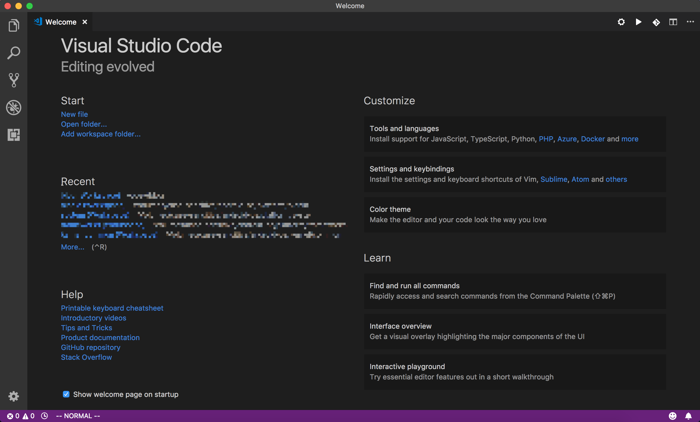
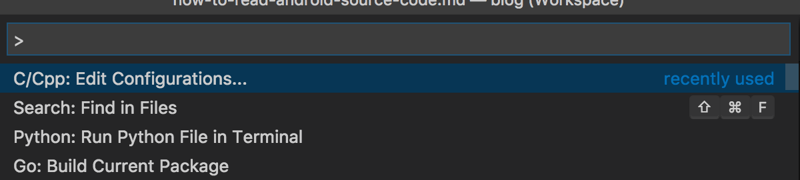
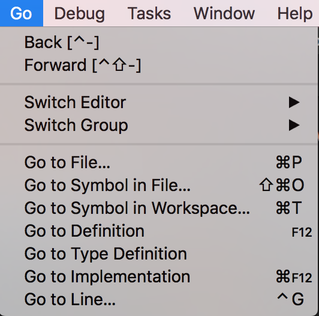
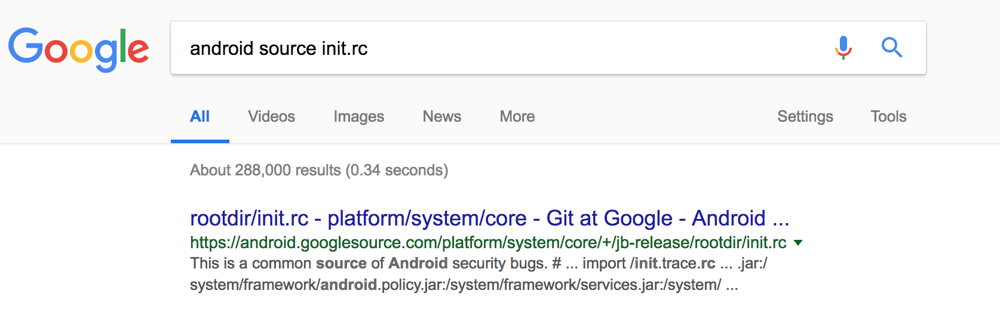
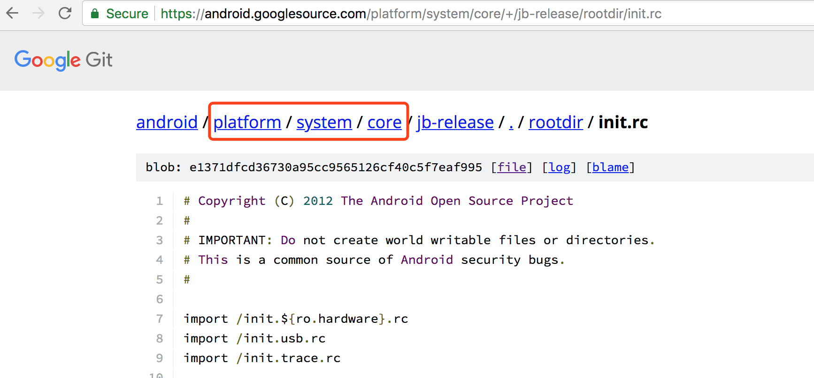

# 如何使用 Visual Studio Code 阅读 Android 源码

## 环境准备

> **需要提醒的是，本篇文章不会教你如何编译 Android 源码，我也不打算这么做。**

### VS Code 安装

VS Code 是微软的开源编辑器，类似于 Atom，对各种语言的支持可以通过安装插件解决。软件的安装、下载，大家就自行解决吧，没有什么值得说的。

Android 源码中主要是 C/C++、Java 代码，为此，我们至少需要安装 C++ 和 Java 插件。插件的安装入口，可以直接从 Welcome 页面进入


如果你习惯了使用 Android Studio，从 “Settings of keybindings” 进入，安装一个 IntelliJ IDEA Keybindings。

其他插件按需下载。

### 源码下载

关于源码我的观点是，如果仅仅为了阅读，没有必要下载所有源码仓库（估计超过 60G）。对于大部分人来说，我们只需要阅读 frameworks/base, frameworks/native, system/core 和内核的源码。所以，把这几个参考下载下来就可以了。

也就是说，单独下载你需要阅读的仓库，其他一概不管。

不过这里有一个例外。如果你立志于系统开发，那还是老老实实用 repo 把所有仓库下载下来吧。

关于源码存放的位置，原则上无所谓，不过建议按照源码放好。以下是我本地仓库的一个示例。

```
├── kernel
│   └── common
├── platform
│   ├── art
│   ├── bionic
│   ├── dalvik
│   ├── frameworks
│   │   ├── base
│   │   └── native
│   ├── hardware
│   ├── libnativehelper
│   └── system
└── skia
```

源码下载的地址，可以在 [googlesource.com](https://android.googlesource.com/) 找到。如果你没有梯子，就直接在 [GitHub](https://github.com/aosp-mirror) 下载吧。

用 VS Code 打开时，建议每个 workspace 只打开上面的一个仓库，免得运行太慢。

提升：第一次打开的时候，会发现无法调整到函数实现。这是因为插件还在后台索引文件，耐心等待即可。如果很久了还是卡在那里，重启应用 :)

## 一些小技巧

### 从哪里开始阅读

采用我这种方法，有些人可能要说，没有运行过代码，不知道执行的结果。没错，我也不知道！

但是，这些事情已经有人帮我们折腾出来了，我们就省点心吧。阅读源码的第一步 —— 从阅读书籍开始。如果你不想买书、看书，那就找别人写的博客来看吧。

通过学习别人的经验，可以对某个子系统有个大概的了解。只要知道入口在哪里，接下来，就可以自行开始阅读。或者，在阅读别人源码分析文章的同时，一边阅读源码。

不管你是看书还是看博客，我都推荐从 binder 开始。其他的，就看你的喜好了。对于应用程序员，大部分人会建议你去看 View/ViewGroup，AMS，PMS 等等。这部分基本上是 Java 代码，对于计算机基础比较薄弱的同学，可能会是一个比较好的选择。

我比较懒，不喜欢 framework 那又臭又长的 Java 代码，所以到现在为止只看了 binder 驱动、Handler。现在（2018.5.11）在看 logd 的代码。之所以看这些，只是因为这里面没有太多的业务逻辑。不过，这部分需要比较多的背景知识。大家根据自身情况进行选择。

### 推荐书籍

- 《Android 框架揭秘》
- 《深入理解 Android》系列
- 《Android系统源代码情景分析》

如果你不满足于只看一点 Java 代码而又苦于基础薄弱，下面再推荐几本：

#### C 语言
- 《C和指针》
- K&R C

#### C++
- 《C++ Primer》(不是 C++ Primer Plus)
- 《Effective C++》，《More Effective C++》
- 《深度探索C++对象模型》

#### 系统编程
- 《Linux系统编程》
- 《UNIX环境高级程序设计》（俗称 APUE）
- 《UNIX 网络编程》（俗称 UNE）

#### Linux 内核
- 《Linux内核设计与实现》
- 《深入理解Linux内核》

深呼吸，冷静，你不需要把上面所有的书都看完。只是为了阅读源码，你只要把每一项的第一本看完就足够了。

### Java 代码的跳转

frameworks/base 里面大多是 Java 代码，VS Code 打开后，你需要告诉它对应的 classpath。这个可以通过创建一个 build.gradle 解决。
```gradle
# frameworks/base/build.gradle

apply plugin: 'java'

sourceSets {
    main {
        java {
            srcDirs 'core/java'
            srcDirs 'graphics/java'
        }
    }
}
```
剩下的，根据需要再加进去就好。

### C/C++ 代码跳转

C/C++ 代码的设置方法跟 Java 不太一样，插件提供了一个模板给我们。

在 Mac 上，使用 Shift + Command + P 打开 Command Pallette。找到 C/Cpp: Edit configurations


然后就会打开一个 `c_cpp_properties.json` 文件。下面是我给 system/core 配置的 `c_cpp_properties.json`。

需要修改的就三个地方，`includePath`, `browse` 里的 `path`, 还有 `defines`。其余的读者可以自行修改：
```JSON
{
    "configurations": [
        {
            "name": "Mac",
            "includePath": [
                "${workspaceFolder}",
                "${workspaceFolder}/core/include",
                "${workspaceFolder}/core/base/include",
                "${workspaceFolder}/core/logd/",
                "${workspaceFolder}/core/libutils/include",
                "${workspaceFolder}/core/liblog/include",
                "${workspaceFolder}/core/libcutils/include",
                "${workspaceFolder}/core/libsystem/include",
                "/Volumes/case-sensitive/android-os/platform/bionic/libc/include",
                "/Volumes/case-sensitive/android-os/platform/bionic/libc/kernel/uapi",
                "/Volumes/case-sensitive/android-os/platform/bionic/libc/kernel/uapi/asm-x86",
                "/Volumes/case-sensitive/android-os/platform/bionic/libc/kernel/android/uapi",
                "/Applications/Xcode.app/Contents/Developer/Toolchains/XcodeDefault.xctoolchain/usr/include/c++/v1",
                "/usr/local/include",
                "/Applications/Xcode.app/Contents/Developer/Toolchains/XcodeDefault.xctoolchain/usr/lib/clang/9.0.0/include",
                "/Applications/Xcode.app/Contents/Developer/Toolchains/XcodeDefault.xctoolchain/usr/include",
                "/usr/include"
            ],
            "defines": [
                "__ANDROID__"
            ],
            "intelliSenseMode": "clang-x64",
            "browse": {
                "path": [
                    "${workspaceFolder}",
                    "${workspaceFolder}/core/include",
                    "${workspaceFolder}/core/base/include",
                    "${workspaceFolder}/core/logd/",
                    "${workspaceFolder}/core/libutils/include",
                    "${workspaceFolder}/core/liblog/include",
                    "${workspaceFolder}/core/libcutils/include",
                    "${workspaceFolder}/core/libsystem/include",
                    "/Volumes/case-sensitive/android-os/platform/bionic/libc/include",
                    "/Volumes/case-sensitive/android-os/platform/bionic/libc/kernel/uapi",
                    "/Volumes/case-sensitive/android-os/platform/bionic/libc/kernel/uapi/asm-x86",
                    "/Volumes/case-sensitive/android-os/platform/bionic/libc/kernel/android/uapi",
                    "/Applications/Xcode.app/Contents/Developer/Toolchains/XcodeDefault.xctoolchain/usr/include/c++/v1",
                    "/usr/local/include",
                    "/Applications/Xcode.app/Contents/Developer/Toolchains/XcodeDefault.xctoolchain/usr/lib/clang/9.0.0/include",
                    "/Applications/Xcode.app/Contents/Developer/Toolchains/XcodeDefault.xctoolchain/usr/include",
                    "/usr/include"
                ],
                "limitSymbolsToIncludedHeaders": true,
                "databaseFilename": ""
            },
            "macFrameworkPath": [
                "/System/Library/Frameworks",
                "/Library/Frameworks"
            ],
            "compilerPath": "/usr/bin/clang",
            "cStandard": "c11",
            "cppStandard": "c++17"
        },
        {
            "name": "Linux",
            "includePath": [
                "/usr/include",
                "/usr/local/include",
                "${workspaceFolder}"
            ],
            "defines": [],
            "intelliSenseMode": "clang-x64",
            "browse": {
                "path": [
                    "/usr/include",
                    "/usr/local/include",
                    "${workspaceFolder}"
                ],
                "limitSymbolsToIncludedHeaders": true,
                "databaseFilename": ""
            }
        },
        {
            "name": "Win32",
            "includePath": [
                "C:/Program Files (x86)/Microsoft Visual Studio 14.0/VC/include",
                "${workspaceFolder}"
            ],
            "defines": [
                "_DEBUG",
                "UNICODE",
                "_UNICODE"
            ],
            "intelliSenseMode": "msvc-x64",
            "browse": {
                "path": [
                    "C:/Program Files (x86)/Microsoft Visual Studio 14.0/VC/include/*",
                    "${workspaceFolder}"
                ],
                "limitSymbolsToIncludedHeaders": true,
                "databaseFilename": ""
            }
        }
    ],
    "version": 4
}
```

### 跳转到文件、符号

参考 Go 菜单



### 找不到文件在哪里

找不到文件时，可以使用 Google 搜索文件名。比方说，init.rc 文件：


点击第一个链接，进入后可以看到这个：


现在，我们知道文件的位置了。

### 找不到函数的定义

参考上一节。
