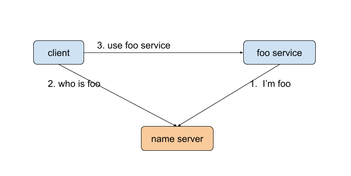
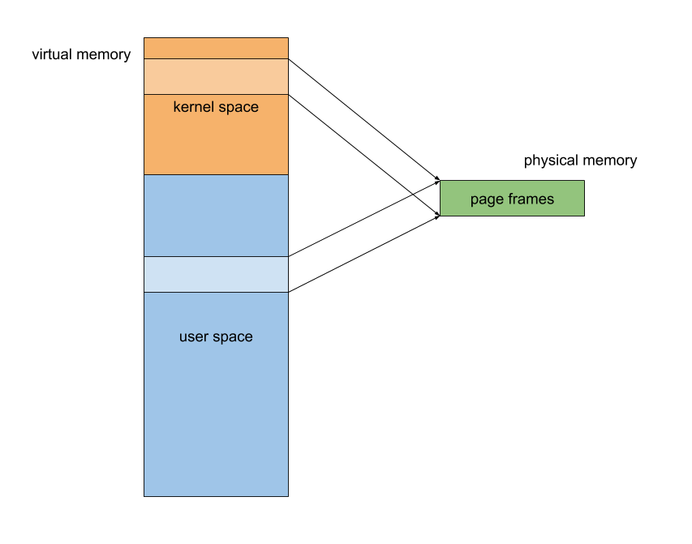

### binder 情景分析 —— service manager 的启动

#### RPC 的一般架构

我们知道，binder 实际上是 RPC（remote procedure call）的一种。在开始学习 binder 之前，如果能够对 RPC 有所了解，将会非常有帮助。



首先，系统会启动一个名字服务器（name server）。当某个服务启动的时候（如，这里的 foo service），他会跟名字服务器注册。而后的某个时间点，如果有客户端想要访问 foo service，由于他事先不知道 foo service 的位置，他就会先请求名字服务器。得到 foo service 的位置后，再向 foo service 发出服务请求。

在我们 Android 系统，binder 也是一样的架构。扮演名字服务器这一角色的，就是 **service manager**。

> 注：以下 framework 源码使用 oreo-release 分支，kernel 部分使用 common 的 android-4.9-o-release 分支。部分代码为了可读性，在不影响结果的情况下作了删改。

<br>

#### 总体流程


图片左边表示应用层执行的系统调用，右边为 binder 驱动程序中对应的函数，binder 驱动程序运行在内核态。

1. 首先，调用 `open` 打开 binder 驱动，对应的，内核里会执行 `binder_open`。
2. `mmap` 申请一个内存映射块。内核分配完响应的内存后，执行驱动程序注册的 `binder_mmap`。
3. `ioctl` 将自己注册为名字服务。它则是对应 `binder_ioctl`。

下面详细说明每个步骤。

<br>

#### service manager 的启动

前面我们说，名字服务器必须是最先启动的。所以，service manager 也必须在系统的早期启动。我们知道，Linux 系统中，最早启动的是 init 进程。如此一来，由 init 进程启动 service manger 似乎是一个不错的选择。在 Android 系统里，service manager 也的确是由 init 进程启动的。

```
// system/core/rootdir/init.rc
on post-fs
    # Load properties from
    #     /system/build.prop,
    #     /odm/build.prop,
    #     /vendor/build.prop and
    #     /factory/factory.prop
    load_system_props
    # start essential services
    start logd
    start servicemanager
    # ...
```
`init.rc` 文件由 init 进程在启动后解析并执行。从这里我们可以看出，service manager 确实是由 init 进程启动的。关于 init 进程的内容在这里不展开讨论，有兴趣的读者可以自行阅读（源码在 `system/core/init/` 目录下）。

<br>

#### 打开 binder 驱动

```C
// frameworks/native/cmds/servicemanager/service_manager.c
int main(int argc, char** argv) {
    struct binder_state *bs;
    bs = binder_open("/dev/binder", 128*1024);
    //...
}
```

servicemanager 的 `main` 函数开始执行后，调用 `binder_open` 打开 binder 驱动。`/dev/binder` 是 binder 驱动对应的设备文件。

```C
// frameworks/native/cmds/servicemanager/binder.c
struct binder_state *binder_open(const char* driver, size_t mapsize) {
    struct binder_state *bs;
    bs = malloc(sizeof(*bs));
    bs->fd = open(driver, O_RDWR | O_CLOEXEC);
    // ...

    return bs;
}
```

`open()` 函数打开文件后，将返回一个 `int` 类型的文件描述符（file descriptor）。后续对 binder 的操作，都通过这个 `fd` 进行。

其中，`O_RDWR` 表示打开用于读写。`O_CLOEXEC` 为 “close on exec”。意思是，如果进程调用了 `exec` 函数，需要关闭对应的文件。

`open` 执行后，将会陷入内核，最终来到 binder 驱动的 `binder_open` 函数：

```C
// kernel/kernel_common/drivers/android/binder.c
static int binder_open(struct inode *nodp, struct file *filp) {
    struct binder_proc *proc;
    proc = kzalloc(sizeof(*proc), GFP_KERNEL);
    // init proc ...
    binder_dev = container_of(filp->private_data, struct binder_device,
                              miscdev);
    proc->context = &binder_dev->context;
    filp->private_data = proc;

    // ...
}

// kernel/kernel_common/drivers/android/binder.c
struct binder_device {
    struct hlist_node hlist;
    struct miscdevice miscdev;
    struct binder_context context;
};
```

这里首先调用 `kzalloc` 分配一个 `struct binder_proc`。由于每个进程只会调用一次 `open("/dev/binder")`，一个进程对应一个 `binder_proc`。

`binder_dev` 是一个 `struct binder_device`，对应着我们的 binder 驱动，我们将 binder 驱动的 `binder_context` 赋值给 `proc->context`。之所以特别提到它，是因为 `struct binder_context` 存储了名字服务。这个我们在后面再详细讨论，这里需要留意的点是，`binder_context` 对应着一个 binder （虚拟）设备，他是唯一的。

前面我们说，每次操作 binder 的时候都需要传递一个文件描述符。通过这文件描述符，内核就可以拿到文件对应的 `struct file`。每个打开的文件对应一个 `struct file`。传递给 `binder_open` 的参数 `filp` 就是我们前面调用 `open` 时创建的 `struct file`。

通过把 `proc` 保存到 `filp->private_data`，每次操作 binder 的时候，binder 都可以通过 `filp` 拿到对应的 `struct binder_proc`。

<br>

#### 创建内存映射

打开 binder 驱动后，service manager 会调用 `mmap` 申请一块内存映射块。

```C
// frameworks/native/cmds/servicemanager/binder.c
struct binder_state *binder_open(const char* driver, size_t mapsize) {
    struct binder_state *bs;

    // ...

    bs->mapsize = mapsize;
    bs->mapped = mmap(NULL, mapsize, PROT_READ, MAP_PRIVATE, bs->fd, 0);

    // ...
}
```

这里 `mapsize = 128*1024`，`PROT_READ` 表示读权限，我们只会对所申请的内存做读操作（binder 驱动会写入内容）。

```C
// kernel/kernel_common/drivers/android/binder.c
static int binder_mmap(struct file *filp, struct vm_area_struct *vma) {
    struct binder_proc *proc = filp->private_data;

    // ...

    binder_alloc_mmap_handler(&proc->alloc, vma);
    return 0;
}
```

这里印证了上面的说法，我们确实是通过 `filp` 来获取对应的 `struct binder_proc`。

`struct vm_area_struct` 是内核用于管理内存的结构体，这里它对应于我们通过 `mmap` 所申请的内存块。

`proc->alloc` 是一个 `struct binder_alloc`。binder 驱动程序通过它来管理所申请的内存块。


```C
// kernel/kernel_common/drivers/android/binder_alloc.c
int binder_alloc_mmap_handler(struct binder_alloc *alloc,
                              struct vm_area_struct *vma) {
    int ret;
    struct vm_struct *area;
    struct binder_buffer *buffer;

    // get vm_area in kernel space
    area = get_vm_area(vma->vm_end - vma->vm_start, VM_IOREMAP);
    alloc->buffer = area->addr;
    alloc->user_buffer_offset =
        vma->vm_start - (uintptr_t)alloc->buffer;

    // alloc pages for the vm_area
    alloc->pages = kzalloc(sizeof(alloc->pages[0]) *
                   ((vma->vm_end - vma->vm_start) / PAGE_SIZE),
                   GFP_KERNEL);
    alloc->buffer_size = vma->vm_end - vma->vm_start;

    buffer = kzalloc(sizeof(*buffer), GFP_KERNEL);

    // let pages map to the same physical page frame
    // as user's.
    __binder_update_page_range(alloc, 1, alloc->buffer,
                               alloc->buffer + BINDER_MIN_ALLOC, vma);
    buffer->data = alloc->buffer;
    list_add(&buffer->entry, &alloc->buffers);
    buffer->free = 1;
    binder_insert_free_buffer(alloc, buffer);
    alloc->free_async_space = alloc->buffer_size / 2;
    barrier();
    alloc->vma = vma;
    alloc->vma_vm_mm = vma->vm_mm;

    return 0;
}
```

`binder_alloc_mmap_handler` 执行后的内存如下图所示。



这里先调用 `get_vm_area` 在内核空间分配了一个地址段，然后为这个地址段分配 `struct page`（默认情况下，一个 page 为 4K，`struct page` 包括了相应内存页对应的物理页帧(page frame)的信息）。最后将这些 `struct page` 与对应的物理内存页映射起来。

最后，用户空间、内核空间都有一个内存段，对应着相同的物理内存页。内核写入数据后，应用程序即可以直接读到。

最后值得留意的是 `alloc->user_buffer_offset`。它保存了内核地址跟用户地址的差值，以后还会用到它。

<br>

#### 注册为名字服务器

```C
// frameworks/native/cmds/servicemanager/service_manager.c
int main(int argc, char** argv) {
    struct binder_state *bs;
    // ...

    bs = binder_open(driver, 128*1024);
    binder_become_context_manager(bs);

    // ...
}
```

这里调用 `binder_become_context_manager()` 注册为名字服务器。基于此，也有人叫 service manager 作 **context manager**。

```C
// frameworks/native/cmds/servicemanager/binder.c
int binder_become_context_manager(struct binder_state *bs) {
    return ioctl(bs->fd, BINDER_SET_CONTEXT_MGR, 0);
}
```
`binder_become_context_manager` 很简单，就一行代码。`ioctl` 是所谓的 io control，放了一些不方便归类的杂项函数。

```C
#include <sys/ioctl.h>
int ioctl(int fildes, unsigned long request, ...);
```
- `fildes`：文件描述符
- request：一个 `unsigned long` 型的数值，用来表示特定的服务。`BINDER_SET_CONTEXT_MGR` 表示注册为 context manager。
- 第三个参数是请求的其他参数

```C
// kernel/kernel_common/drivers/android/binder.c
static long binder_ioctl(struct file *filp, unsigned int cmd, unsigned long arg) {
    switch (cmd) {
    // ...
    case BINDER_SET_CONTEXT_MGR:
        ret = binder_ioctl_set_ctx_mgr(filp);
        if (ret)
            goto err;
        break;
    // ...

    return ret;
}

// kernel/kernel_common/drivers/android/binder.c
static int binder_ioctl_set_ctx_mgr(struct file *filp) {
    int ret = 0;
    struct binder_proc *proc = filp->private_data;
    struct binder_context *context = proc->context;
    struct binder_node *new_node;

    ret = security_binder_set_context_mgr(proc->tsk);
    if (ret < 0)
        return ret;
    new_node = binder_new_node(proc, NULL);
    context->binder_context_mgr_node = new_node;

    return 0;
}
```
`security_binder_set_context_mgr` 用于检测调用进程是否有权限执行 `binder_set_context_mgr`。service manager 显然是有权限的。接下来 `binder_new_node()` 生成一个 `binder_node`。一个服务对应一个 `struct binder_node`，一个进程可以有多个服务。

我们将新生成的 `struct binder_node` 赋值给 `context->binder_context_mgr_node`，即是注册了名字服务。前面我们说过，所有的 `binder_proc->context` 都指向 `binder_device` 中的 `context`。这里对它，即可以让所有的进程都访问到 service manager 的 `binder_node`。通过这个 `binder_node`，便可以使用 service manager 提供的名字服务。

到这里，名字服务的注册便完成了。

<br><br>


