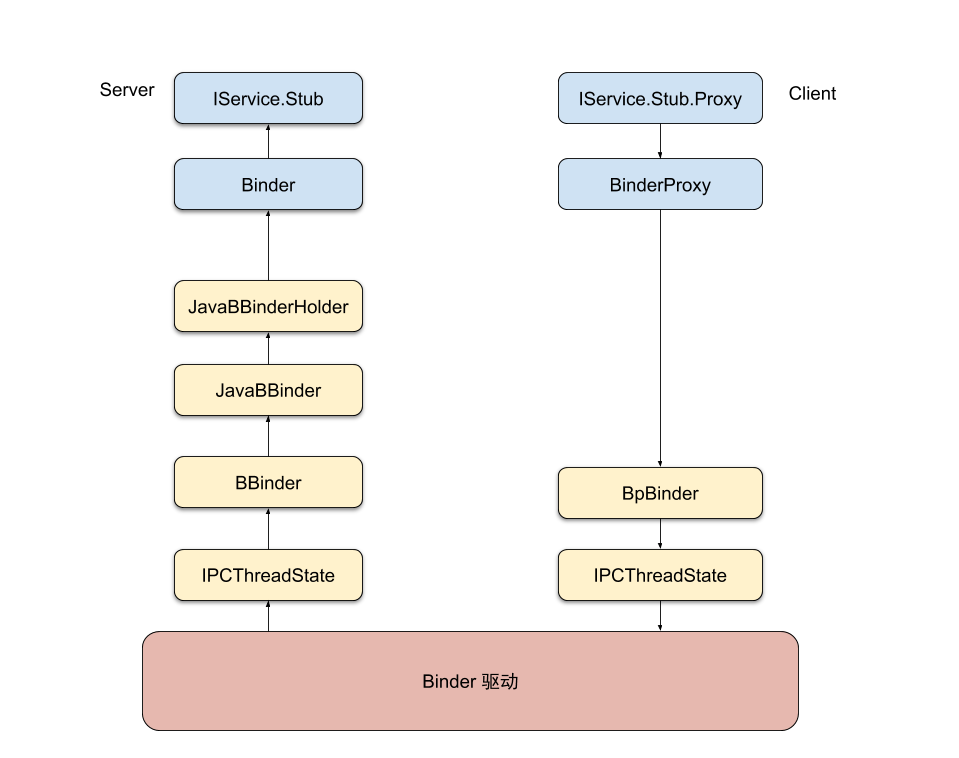

### binder 情景分析 - RemoteListenerCallback 为什么可以正常工作？

为了不迷失在源码中，在开始之前，我们先来看一个图。后面如果对某个对象所处的位置模糊，可以回过头来复习一下。图中的箭头表示客户向服务发起一次请求的数据流向。



最上面是 Java，中间是 C++，最下面是位于内核的 binder 驱动。


<br>

#### `RemoteCallbackList` 的使用场景

假设我们有如下这么一个服务：
```Java
interface IService {
    boolean register(Callback callback);
    boolean unregister(Callback callback);
}
```
客户端可以通过 AIDL 向服务注册一个回调。普通的情况下，这一类回调我们可以放在 `CopyOnWriteList` 里面。但在多进程的环境下，就要小心了。事实上，每次客户端调用 `register/unregister`，服务端收到的都是不同的对象。这样一来， `CopyOnWriteList` 也就失灵了。

不过别担心，Android 的设计者已经帮我们考虑到了这个问题，并且提供了 `RemoteCallbackList` 来解决它。具体的用法大家可以参考文档或者《Android开发艺术探索》第二章的内容。

<br>

#### `RemoteCallbackList` 生效的关键

作为一个好奇心比较重的人，我们还是忍不住要看看 `RemoteCallbackList` 究竟施展了什么魔法，解决了对象不一致的问题。关键的源码整理出来，主要是这些：
```Java
class RemoteCallbackList {
    ArrayMap<IBinder, Callback> mCallbacks
            = new ArrayMap<IBinder, Callback>();
    
    public boolean register(E callback, Object cookie) {
        IBinder binder = callback.asBinder();
        Callback cb = new Callback(callback, cookie);
        mCallbacks.put(binder, cb);
        return true;
    }

    public boolean unregister(E callback) {
        Callback cb = mCallbacks.remove(callback.asBinder());
        return true;
    }
}
```
我们看到，跟 `CopyOnWriteList` 最主要的区别在于，他使用对应的 `IBinder` 作为 key 来存储。也就是说，**我们每次调用 `register/unregister`，服务端拿到的都是同一个对象**。这就是问题的关键。接下来我们继续挖，看看系统是如何每次都返回同一个对象。

<br>

#### 如何做到每次都返回同一个对象

现在，如果你对照开头那个图，你就会发现，`RemoteCallbackList` 用来当做 key 的那个 `IBinder` 实际上是 `BinderProxy`。这里要注意的是，图中各个数据结构的创建、binder 如何传递数据等问题虽然非常重要，但均不在本篇描述。这里我们仅仅关心 `Binder` 传递到图的左侧的 Server 端时，如何保证每次返回的 `BinderProxy` 都是同一个对象。

> 注：对照上面的图，你可能会觉得奇怪，`BinderProxy` 不是客户端的吗？为什么这里是服务端拿到的。其实客户、服务是相对的，当我们调用 `register` 的时候，调用者是客户端，被调用的是服务端。但服务器在使用这个 `callback` 时，它的角色就是客户端。所以这里拿到的 `callback` 实际是客户端一侧的东西。

> 注：源码使用 oreo-release 分支。为了可读性，在不影响结果的情况下对部分代码进行了删改。

我们从 Parcel 开始看。客户端调用 `register()` 的时候，传入了一个 `IBinder`，服务端需要把他从 Parcel 里面读出来：
```Java
// AIDL 生成的代码
class IService.Stub extends Binder implements IService {

    boolean onTransact(int code, Parcel data, Parcel reply, int flag) {
        // ...
        Callback _arg0;
        _arg0 = Callback.Stub.asInterface(data.readStrongBinder());
        register(_arg0);
        // ...
    }
}
```
这里 `data.readStrongBinder()` 返回的，就是一个 `IBinder` 对象。更具体一点，在这里服务端拿到的，是一个 `BinderProxy`。

`Parcel` 的 `readStrongBinder` 调用的是一个 JNI 方法：
```Java
// Parcel.java
public final IBinder readStrongBinder() {
    return nativeReadStrongBinder(mNativePtr);
}
```
```C++
// frameworks/base/core/jni/android_os_Parcel.cpp
static jobject android_os_Parcel_readStrongBinder(
    JNIEnv* env, jclass clazz, jlong nativePtr) {
    Parcel* parcel = reinterpret_cast<Parcel*>(nativePtr);
    if (parcel != NULL) {
        return javaObjectForIBinder(env, parcel->readStrongBinder());
    }
    return NULL;
}
```
通过 JNI，调用的是 C++ 层的 `Parcel` 的 `readStrongBinder()` 方法（没错，C++层也有一个类叫`Parcel`）。继续往下走，会来到这里

```C++
// framework/native/libs/binder/Parcel.cpp
status_t unflatten_binder(const sp<ProcessState>& proc,
    const Parcel& in, sp<IBinder>* out) {
    const flat_binder_object* flat = in.readObject(false);
    // ...
    *out = proc->getStrongProxyForHandle(flat->handle);
    return static_cast<BpBinder*>(out->get());
}
```
虽然 `ProcessState` 在我们上面的图里没有出现，但我们却发现了 `BpBinder` 的身影。还记得吗？`BinderProxy` 再往下，就是 `BpBinder`。马上答案就揭晓了，加油，我们继续深入 `ProcessState` 内部。
```C++
// framework/native/libs/binder/ProcessState.cpp
sp<IBinder> ProcessState::getStrongProxyForHandle(int32_t handle) {
    handle_entry* e = lookupHandleLocked(handle);
    if (b == NULL || !e->refs->attemptIncWeak(this)) {
        b = new BpBinder(handle); 
        e->binder = b;
        result = b;
    } else {
        result.force_set(b);
        e->refs->decWeak(this);
    }
    return result;
}
```
如果对 binder 不熟悉，可以将这里的 `handle` 可以当做对方的“IP”，通过这个“IP”，我们就能够给对方发送消息。

可以看到，`ProcessState` 把 `BpBinder` 缓存起来了。这样，每次我们 `register/unregister`，服务端拿到的都是**同一个** `BpBinder` 对象。

我们的目标是找到“同一个`BinderProxy`”，而这里的出现了“同一个 `BpBinder`”。有理由相信，我们很快就可以找到答案。

下面是最后一步，但我们先回到开头的 `Parcel`：

```C++
// frameworks/base/core/jni/android_os_Parcel.cpp
static jobject android_os_Parcel_readStrongBinder(
    JNIEnv* env, jclass clazz, jlong nativePtr) {
    Parcel* parcel = reinterpret_cast<Parcel*>(nativePtr);
    if (parcel != NULL) {
        return javaObjectForIBinder(env, parcel->readStrongBinder());
    }
    return NULL;
}
```
现在可以看到，`parcel->readStrongBinder()` 每次都返回同一个 `BpBinder` 对象。最后，我们看看 `javaObjectForIBinder`:
```C++
// frameworks/base/core/jni/android_util_Binder.cpp
jobject javaObjectForIBinder(JNIEnv* env, const sp<IBinder>& val) {
    jobject object = (jobject)val->findObject(&gBinderProxyOffsets);
    if (object != NULL) {
        return jniGetReferent(env, object);
    }
    object = env->NewObject(gBinderProxyOffsets.mClass,
                            gBinderProxyOffsets.mConstructor);
    if (object != NULL) {
        val->attachObject(&gBinderProxyOffsets, refObject,
                jnienv_to_javavm(env), proxy_cleanup);
    }
    return object;
}
```
这里，我们先从 `BpBinder` 里面 `findObject`，如果找到了，就直接返回，所返回的对象，就是 `BinderProxy`。如果找不到（第一次创建的时候），就会 `newObject`，然后调用 `attachObject` 存起来；下次执行这段代码的时候，`findObject` 就会返回我们 attach 的对象。也就是说，对于同一个 binder，每次都会使用同一个 `BinderProxy` 实例。`BpProxy`也是如此。

<br><br>